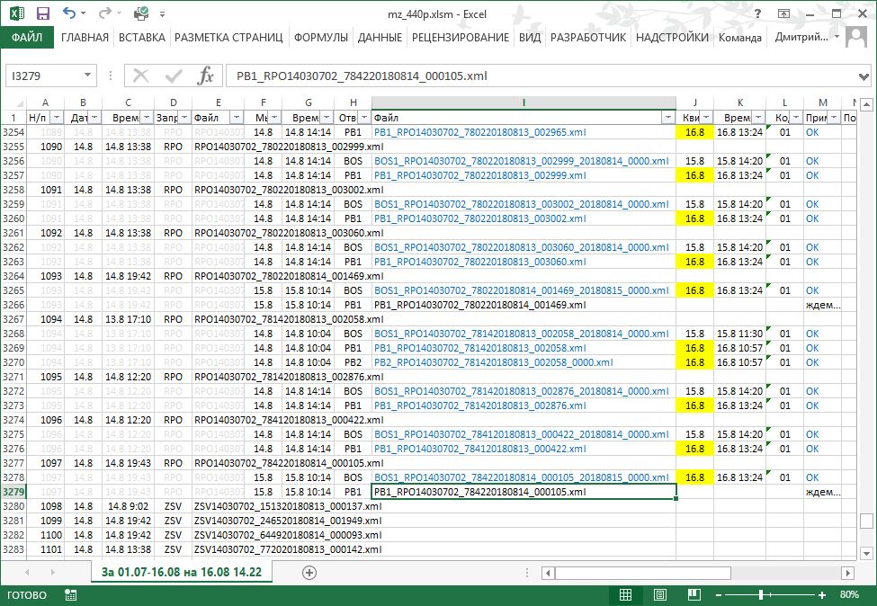

# [mz_440p](http://diev.github.io/mz_440p)
Мониторинг обмена с ФНС России по Положению Банка России N 440-П.



## Основание
Положение Банка России от 06.11.2014 N 440-П "О порядке направления в банк 
отдельных документов налоговых органов, а также направления банком в 
налоговый орган отдельных документов банка в электронной форме в случаях, 
предусмотренных законодательством Российской Федерации о налогах и сборах", 
зарегистрированное Министерством юстиции Российской Федерации 25.11.2014 
N 34911, устанавливает порядок направления в банк в электронной форме 
документов налоговых органов.

Принято взамен ранее действовавшего Положения N 365-П.

## Как подготовить
Вы можете взять готовый бинарный файл XLSM с этой программой из Downloads 
(в Releases) и при запуске обязательно разрешить макросы - только тогда 
появится меню "Надстройки".

Если боитесь запускать чужие бинарные файлы и макросы (и это правильно!) - 
открывайте редактор VBA в своем Excel (может понадобится в Настройках 
включить меню "Разработчик") и импортируйте туда прилагаемые исходные 
тексты (здесь они все в кодировке UTF-8 - Вам понадобится их сконвертировать 
в кодировку Windows-1251).

В тексте макроса надо будет подправить константы на Ваши пути к файлам:

```
Const F440Pin = "D:\OD\FORMS\F440p\in\"
Const F440Prep = "D:\OD\FORMS\F440p\rep\"
Const DatePath = "yyyy\\MM\\dd\\"
```

где:
* IN - Входящие XML
* REP - Исходящие XML

В этих папках файлы обмена должны быть разложены по подпапкам в виде 
Год\Месяц\День (4 цифры, 2 цифры, 2 цифры; с 0, если надо). При желании 
Вы можете последнюю константу (формат даты для функции Format() в VBA) 
указать на свой вкус.

## Как использовать
При запуске (разрешить макросы!) макроса *Refresh* (можно вызвать по кнопке 
"Обновить") будет задан вопрос о выборе периода. Подставленные значения 
по-умолчанию: с первого числа предыдущего месяца по текущую дату. 

Не задавайте слишком большой период для начала, чтобы не ждать долго 
(зависит от числа файлов в документообороте Вашей КО и мощности Вашего 
компьютера).

## Историческая справка
Программа была создана для мониторинга обмена с ФНС, чреватого выставлением 
больших штрафов, в тот момент, когда его весь колбасило при переходе с 
формата TXT на XML и все настраивали свои АБС в августе-сентябре 2017 года. 
Поэтому справа сохранилось несколько столбцов для мониторинга повторных 
переотправок и новых квитанций на них по несколько раз.
Ныне это вряд ли у кого потребуется, но функционал и разметка оставлены.

**mz** - это код посылок по 440-П в обмене [ПТК ПСД](http://ptkpsd.ru/) 
Банка России, где они так и продолжают оставаться в разделе "Положение 365-П". 
Для мониторинга обмена ПТК ПСД рекомендуется легкий 
[PTK-PSD Browser](http://diev.github.io/PTK-PSD-Browser-hta).

## License

Licensed under the [Apache License, Version 2.0](LICENSE).

(Вы можете использовать его совершенно свободно без всяких ограничений 
и претензий.)
